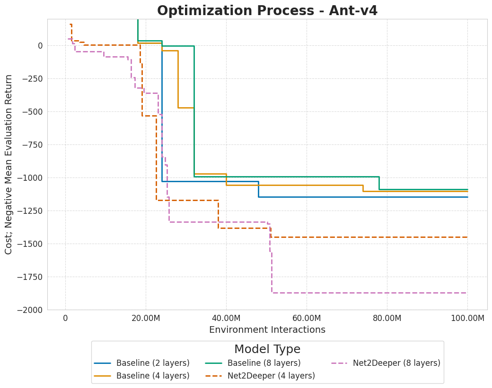

# Master Thesis: Growing With Experience: Growing Neural Networks in Deep Reinforcement Learning
This repository holds the code for the Master Thesis: `Growing With Experience: Growing Neural Networks in Deep Reinforcement Learning`. Our repository contains the code of all experiments conducted for this thesis, and the code to create the plots.



To execute the code, you are required to offer a connection to a MySQL or SQLite database that allows for overlapping database transactions. 

In the following we first provide an installation guide, to then explain the repositories structure, and lastly explain how experiments can be run.

## Installation
1. To install our environment, you first need to clone our implementation and all dependencies using
```bash
git clone https://github.com/automl-private/architectures-in-rl.git --recursive
```
2. Then, create a new Anaconda environment, possibly using
```bash
conda create -n network_growing python=3.8.19
```
3. Next, install the NetHack learning environment. If you encounter issues refer to the documentation at https://github.com/facebookresearch/nle
```bash
pip install ./nle
```
4. To install py_experimenter you first need to adapt `./py_experimenter/py_project.toml` to 
```toml
[tool.poetry.dependencies]
python = "^3.8"
```

5. Next, install MiniHack, PyExperimenter, StableBaselines3 and SMAC3 using 
```bash
pip install ./minihack
pip install ./SMAC3
pip install ./py_experimenter
pip install ./stable-baselines3
```

6. Lastly install the local repo and dependencies using
```bash
pip install .
pip install -r requirements.txt
```

## Code Structure

The main codebase is organized into the following directories:

- **approach**: Contains the core files for running experiments related to different approaches.
    - **approach/ant**: Holds the files for running experiments on the Ant environment.
    - **approach/minihack/net2deeper**: Contains files to run Net2Deeper experiments for a fixed MiniHack environment.
    - **approach/minihack/net2wider**: Contains files to run Net2Wider experiments for a fixed MiniHack environment.
    - **approach/minihack/increase_difficulty**: Contains files to execute Net2Deeper experiments, where the MiniHack environment increases in difficulty as the agent is trained.
    
- **baselines**: Stores the run files for baseline experiments, structured similarly to the `approach` directory.

- **config**: Shold ontains the configuration files for `py_experimenter`. To utilize `MySQL` you need to first create `config/database_credentials.yml` as described in [the documentation](https://tornede.github.io/py_experimenter/usage/experiment_configuration_file.html)

- **hydra_plugins**: Contains early versions of the hypersweeper code.

- **plotting**: Includes all scripts and notebooks used for generating plots.

- **test**: Holds elementary test cases for various network morphisms.

- **utils**: Contains network implementations and additional utility files.

## Execute Experiments 
We explain the execution of experiments by an example rooted in `approach/ant/budget4`. Each experiment is split into: Firstly the `config` directory, a python run script, and a shell file.

### Config Directory
The `config` directory contains a main file, in this case `ant_n2d.yaml` which mainly configures the parameters provided to the hypersweeper, the py_experimenter configuration and additional parameters used for execution. 

#### Main Yaml file
The main `yaml` file is split into three section: 

The `defaults` section contains basic configuration options
```yaml
defaults:
  - _self_
  - slurm                           # Make this a comment if not executing on a slurm cluster
  - configspace: small_space_config # references the used  configspace in configspace/small_space_config
  - override hydra/sweeper: SMAC    # Use the hypersweeper
```

From `hydra_sweeper`to`PY_EXPERIMENTER` the experiments are defined. All adaptations here might lead to problems.

The `PY_EXPERIMENTER` section configures the py_experimenter as shown in the [docs](https://tornede.github.io/py_experimenter/usage/experiment_configuration_file.html#). The most important adaptation options here are the following fields.
```yaml
PY_EXPERIMENTER: 
  Database:
    provider: mysql                             #Configure to use MySQL or SQLite
    database: fehring_growing_nn_new_seeded     #Configure the database name
    table:
      name: ant_net2deeper                      #Configure the table name
```
For an in depth understanding of additional content refer to the [docs](https://tornede.github.io/py_experimenter/usage/experiment_configuration_file.html#) or contact us.

#### Python Run Script
To execute the code locally you need to execute and configure the yaml configuration not to use slurm
```bash
export PYTHONPATH="$PYTHONPATH:/path/to/outer/cwd"
python run/script/name -m
```

#### Run on Cluster
To execute experiments on a cluster run
```bash
sbatch path/to/sh/script.sh
```
This will start a job with the resources as defined in the `sh` script. It will iteratively schedule worker jobs according to the resources specified in `slurm.yaml`.